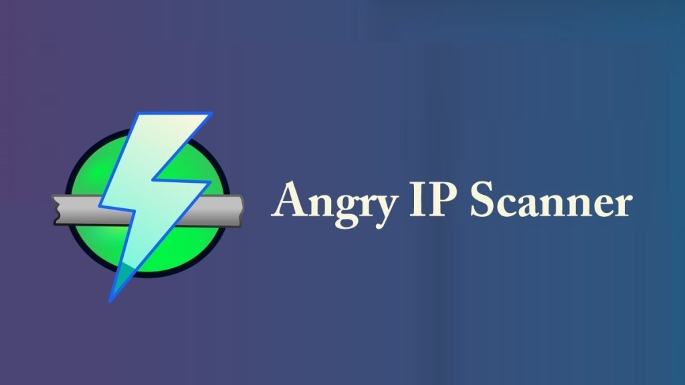
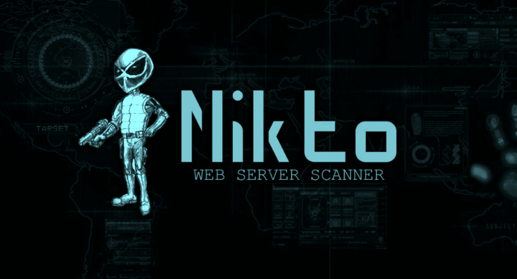

---

Title: Best Hacking Tools
Date: "2020-10-22"
coverImage: "cover1.jpg"
Author: "Akshay Nagle"
description: Learn about the basic hacking tools.
tags: ["Hacking", "Security"]

---
Ever since you enter the sphere of ethical Hacking, you usually need to get your hand on most of the Hacking Tools. The more tools you recognize, the more your hacking career is getting ready to fly off. Therefore let's discuss some of the necessary hacking tools.
			

### 1.) Nmap
  
			

It is a free and open-source tool that's used for network discovery and security auditing.
Nmap is a powerful tool because it is often used to scan vast networks having thousands of machines. It's a command-line tool. Nmap suite additionally includes a complicated GUI that's referred to as "ZenMap".
It supports a large variety of OS that is:
  * Linux
  * Microsoft Windows
  * Mac OS X
  * FreeBSD
  * OpenBSD
  * Solaris
  * IRIX
			

It uses raw IP packets to determine 
  * Hosts that are accessible on the specific networks. 
  * Services that are offered by hosts, i.e., Application name together with its versions.
  * Operating system and its version running on the target system, type of firewall on the target system.
  * Scans for the exploitation of the open port, both TCP and UDP protocols.
			

Nmap download link:
https://nmap.org/download.html
			

### 2.) Metasploit

			

It is essentially a Security Assessment and Penetration Testing tool. Metasploit is often used to launch an attack on alternative systems with it.
It uses a vulnerable system on that security testing may be conducted to use the failings within the system.
			

Metasploit may enforce as follows:
  * Initially, protocol port scanning is complete to get data concerning the target system.
  * Host lists and services running on them may be read and analyzed within the project view. 
  * Now, the vulnerability scan runs on the target system's information that enlists the failings inside the system.
  * This data used for designing the attack on the target system.
			

Metasploit download link:
    https://github.com/rapid7/metasploit-framework/wiki/Nightly-Installers
			

### 3.) Wireshark
  
			

It is an open-source tool that's used to capture traffic on the network. It's essentially a network protocol analyzer tool.
			

Wireshark helps in:
  * Sniffing for the passwords.
  * Identifying the destination and source IP address of the traffic. 
  * Capturing all the packets over the network.
  * Next, we tend to enter the valid John the Ripper command that is used to extract the password from the hash password given as an input.
			

It additionally captures HTTP packet transmission over the network. Click on "Follow protocol connection" within the HTTP packet. Currently, you'll be able to see the username and passwords that are captures over the network.
			

Wireshark download link:
  https://www.wireshark.org/#download
			

### 4.) John the Ripper
  
			

JTR is free and open-source software that's wide employed by hackers for password cracking. It uses the varied cryptanalytics attacks like "Dictionary Attack" and "Brute-Force Attack".
It additionally comes with the business version moreover, i.e., "John the Ripper Professional." It's a lot of accessible versions providing a lot of practicality in password cracking at the enterprise level.
			

John the Ripper working:
  * Initially get the hashed password that needs to be crack.
  * We need to possess a wordlist of expected passwords in our system because it makes the password cracking job easier.
  * Next, we tend to enter the valid John the ripper command that is used in extracting the password from the hash password given as an input.
			

The rate at which the password is going to be cracked depends utterly on the password's strength and offered wordlist. It keeps attempting to break the password continuously till the termination command isn't given.
			

John the ripper download link:
https://www.openwall.com/john/
			

### 5.) Burp Suite
  
			

It is an integrated platform that's used for activity a check on net application security.
It provides a large variety of tools that are used from initial mapping to exploiting the applications' vulnerabilities. Once the issues are detected, hackers will use it to break into the security of the system. 
			

Burp Suite comes in 3 editions:
  1. Community Edition: It is available free of charge for downloading.
  2. Professional Edition: Penetration testers and bug bounty hunters utilize it.
  3. Enterprise Edition: An organization utilizes it.
			

Burp Suite features:
  * It may be used to launch attacks on internet Applications. It will check and detect Cross-site scripting (XSS) and SQL injection.
  * It operates as an internet proxy server that helps permit interception, inspection, and modification of network traffic.
			

Burp Suite download link:
https://portswigger.net/burp
			

### 6.) Angry IP Scanner
  
			

It is one of the quickest IP addresses and port scanner. By exploitation, this hacker will gather data concerning open ports within the target system.
It pings every IP address within the target system to see whether it's active or not. Further, it resolves the hostnames and determines the MAC address.
			

Features:
  * It additionally extracts the NetBIOS data, which has services associated with the session layer within the OSI model that are workgroup names and current active users.
  * Scanned results may be saved in CSV, TXT, XML, or IP-Port list files.
  * It will gather any data concerning scanned IP's because it uses plugins.
  * If anyone writes plugins, he will efficiently extend the practicality of Angry IP Scanner.
			

Angry IP Scanner download link:
  https://angryip.org/download/#windows
			

### 7.) Nikto

			

It is a web-server assessment tool. It is an open-source platform that performs tests against web servers to seek multiple vulnerable files, misconfigurations, out-of-date servers, and programs on its web server.
It depends on HTTP response to seeing whether or not a page or script exists on the target.
			

Features:
  * Provides HTTP proxy support.
  * Checks for the out-of-date server parts.
  * It will scan multiple ports on the server.
  * Guesses credentials for authorization with attempting many alternative ID and password combos.
  * Reports for the weird headers.
			

Nikto download link:
https://github.com/sullo/nikto
