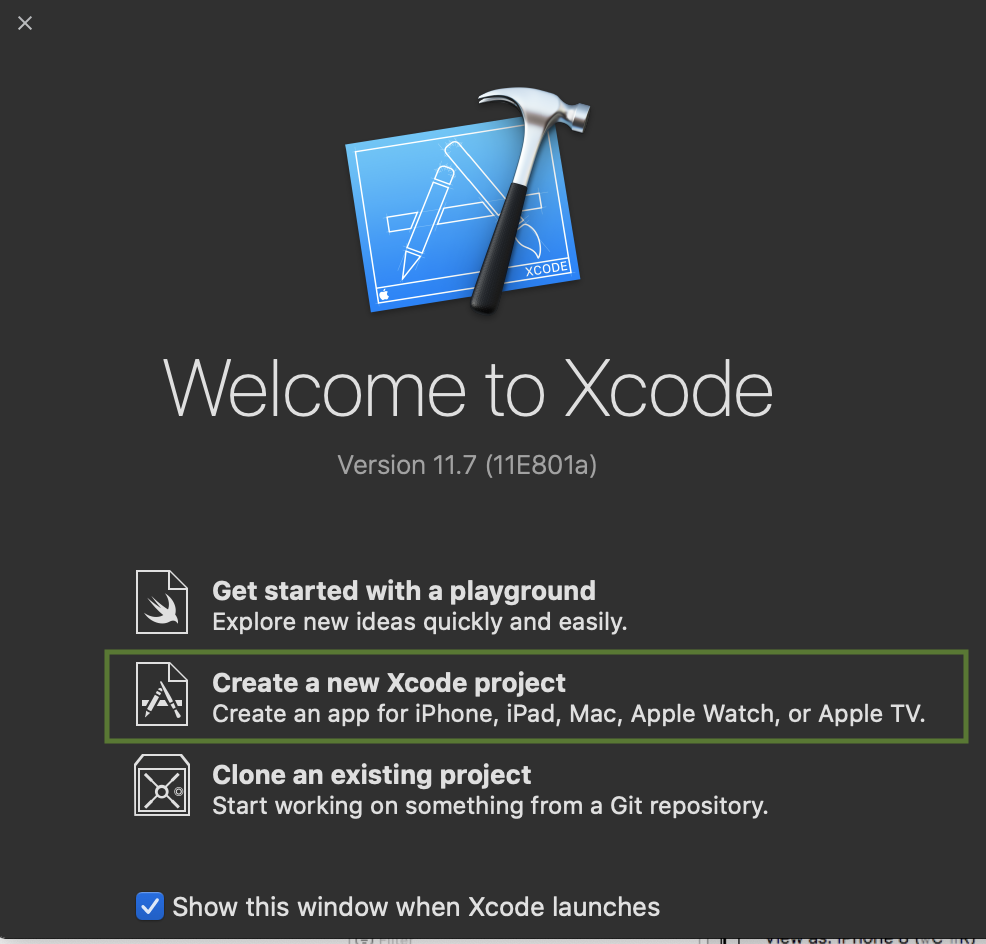
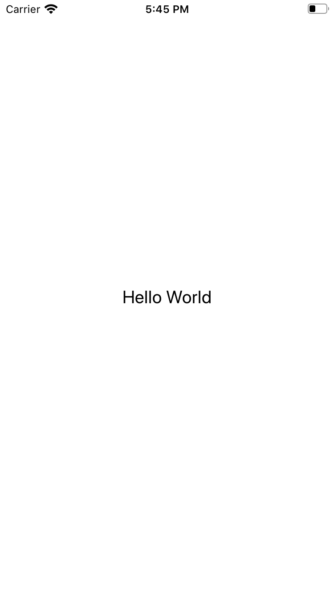

## Introduction
In this blog, you will learn how to start with iOS apps(apps for iPhone/iPad) whether its development of iOS app or running and debugging of existing apps. After this blog, you will be able to start developing iOS app and playing with existing apps.

So let's get started...

### Step 1: Setup your MAC
Apple prefers a closed ecosystem over the open system. iOS can only be run on Apple's own devices including iPhone and iPad.
We can run Mac on window machines using VMWare or Hackintosh etc. but these are not recommended at all.
So as an iOS developer, you will need a Mac for development/debugging/testing of an iOS app.
To develop an iPhone (or iPad) app, you need to get a Mac with an Intel-based processor running on macOS.

### Step 2: Setup your editor for development
To start developing iOS apps, Xcode is the only tool you need to download. Xcode is an integrated development environment (IDE) provided by Apple. It already bundles the latest version of the iOS SDK (short for Software Development Kit), a built-in source code editor, graphic user interface (UI) editor, debugging tools and much more.
You will need an Apple ID to download Xcode, access iOS SDK documentation, and other technical resources. Most importantly, it will allow you to deploy your app to a real iPhone/iPad for testing.

To install Xcode, go up to the Mac App Store. App Store can be found in dock. In the Mac App Store, simply search "Xcode" and click the "Get" button to download it.

### Step 3: Create your first App
Now click and launch Xcode. 
Select create a new Xcode project option. 
Then select Single View App as type and click Next. 
Let's name your project as HelloWorld. 
Choose Team None for now. Select Swift as Language, click Next and you are ready with your empty app doing nothing yet.

Not to worry, you will soon modify your created app showing Hello World. 😍
Now find and open Main.storyboard in the project directory by clicking on it. Storyboard is a file to design your screen and layout all the components such as buttons, labels, lists, tab and navigation bars and many more.
Here you will be seeing a blank view, select the view by clicking upon it. From Xcode 10 or above, for objects like label to add, click on View menu in menu bar>click Show Library and drag label to focused view. 
Or in older Xcode you may find Object Library in the bottom right part of Xcode.
Now double click on the label you have dropped on the view and change it’s text to Hello World!

Feeling excited? 😃

**Here you go with your first-ever app on screen**

### Step 4: Run the App
Select device destination or simulator from the top left of Xcode screen near Run/Stop button . And press Command ⌘ + R to run the app or click the run button. It will initiate the iOS simulator and run your first app.
For running the app on real device, just connect device via cable to Mac. Device will automatically be shown in list of device destinations. Now select the device and press Command ⌘ + R.

Share your first app with your parents and friends and feel proud. 👏 

> Note: If you want to debug or run any existing app/demo instead of developing your own. For ex. You might have some project downloaded from Github on your local system. Now follow the instructions from project's Github to explore the project. 
> Just open the project in Xcode and run in simulator or real device by following step 4 described above.

That's it. 

If you liked this tutorial then share this so that others can learn from it. And comment for any query or suggestion. 
