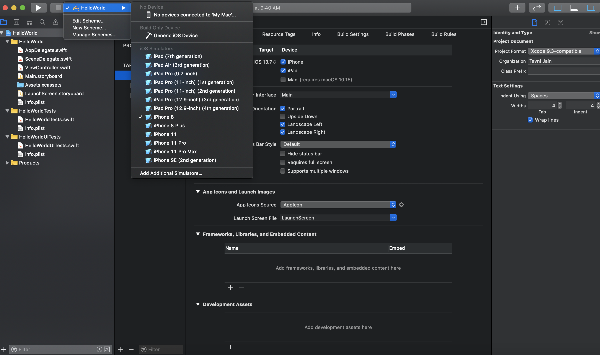

## Introduction
In this blog, you will learn how to start with iOS apps(apps for iPhone/iPad) whether its development of iOS app or running and debugging of an existing app. After this blog, you will be able to start developing iOS app and playing with existing apps.

So let's get started...

### Step 1: Setup your MAC
Apple prefers a closed ecosystem over the open system. iOS can only be run on Apple's own devices including iPhone and iPad.
We can run Mac on window machines using VMWare or Hackintosh etc. but these are not recommended at all for iOS coding purposes.
So basically as an iOS developer, you will need a Mac for development/debugging/testing of an iOS app.

### Step 2: Setup your editor for development
To start developing iOS apps, Xcode is the only tool you need to download. Xcode is an integrated development environment (IDE) provided by Apple. It includes iOS SDK (short for Software Development Kit), a source code editor(UI), debugging tools much more. Many helping tools and needed simulators with a particular iOS version can be installed and added to Xcode as well.
You will need an Apple ID to download Xcode, to deploy your app to a real iPhone/iPad for testing and to download any other software from AppStore.
Appleid is used to authenticate user in Apple devices. You may create it from 
To install Xcode, go up to the Mac App Store. App Store can be found in dock. Login there with your Appleid. In the Mac App Store, simply search "Xcode" and click the "Get" button to download it.

### Step 3: Create your first App
Now click and launch Xcode. 
Choose create a new Xcode project option to make a new project. 
Then choose Single View App option as type of the project and click Next. It will come with one view controller and a storyboard which you can customize further.
Let's name your project as HelloWorld according to convention 😉. 
Choose Team None for now. Select Swift as Language, click Next and you are ready with your empty app doing nothing yet.

> Note: For creating a native iOS app, you have to use one from Objective-c or Swift. Swift is new and easy language provided by Apple, got so much popularity in less time.

Not to worry, you will soon modify your created app saying Hello to the World. 😍
In Xcode, you can navigate to file or folder from left panel of code editor. Right panel of code editor, called Utility Area, will help you dealing with views or any component in storyboard. On top toolbar you can see Run and Stop buttons. And in bottom of code area you can see debug/console area with breakpoint and other runtime tools.

Now find and open Main.storyboard in the project directory by clicking on it. Storyboard is a file to design your view to show and layout all the components such as buttons, labels, lists, tab and navigation bars and many more.
Here you will be seeing a blank view, select the view by clicking upon it. From Xcode 10 or above, for objects like label to add, click on View menu in menu bar>click Show Library and drag label to focused view. 
Or in older Xcode you may find Object Library in the bottom right part of Xcode.
Now double click on the label you have dropped on the view and change it’s text to Hello World!

Feeling excited? 😃

**Here you go with your first-ever app on screen**

### Step 4: Run the App
Select device destination or simulator from the top left of Xcode screen near Run/Stop button. And press Command ⌘ + R to run the app or click the run button. It will initiate the iOS simulator and run your first app.
For running the app on real device, just connect device via cable to Mac. Device will automatically be shown in list of device destinations. Now select the device and press Command ⌘ + R.

Share your first app with your parents and friends and feel proud. 👏 

> Note: If you want to debug or run any existing app/demo instead of developing your own. For ex. You might have some project downloaded from Github on your local system. Now follow the instructions from project's Github to explore the project. 
> Just open the project in Xcode and run in simulator or real device by following step 4 described above.

That's it. 

Hope you liked this tutorial. Kindly share the blog and comment for any query or suggestion. 
