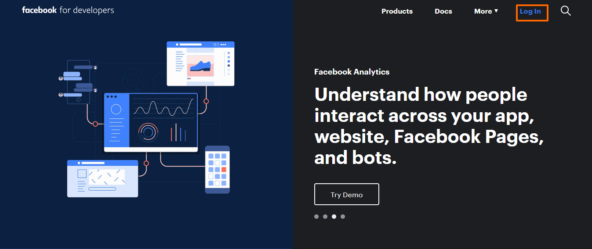
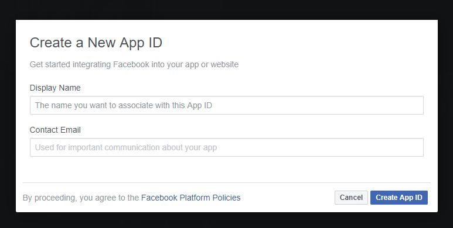
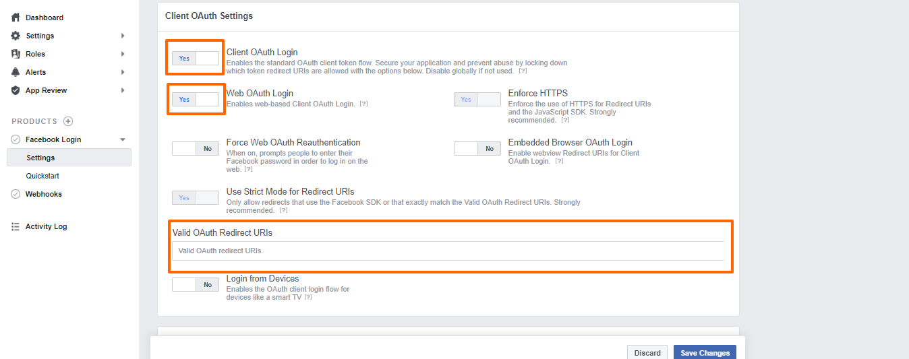
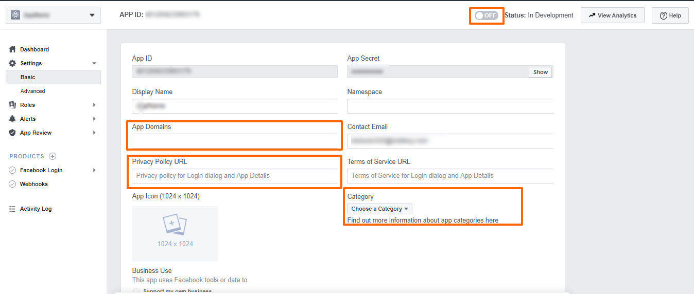

There are more than 1 million websites or apps are using **"Sign with Facebook"** or **"Login with Facebook"**. Do you know why they are using Facebook login?
According to multiple surveys, there are more than 3 billion users worldwide are using social media and it is around 50% of the world's population. 


There are more than 1 billion sites or apps on the world wide. Nowadays, The biggest challenge and most important part, How we can make user registration and login quick and easy while developing a new application. The registration forms required a lot of data that need to fill by users manually and because of that, a lot of web applications lost potential users. Additionally, users need to enter their usernames/emails and passwords in the login forms for authentication. As a user, they have to remember more individual IDs and passwords. 

Social Login allows customers to bring their existing social identities and use them to register and log in without having to explicitly create new profiles. 

 Facebook is the most favorite social media log in, compare to other social media providers. The number of active Facebook users growing day by day. In this article, I will explain how to implement **“Log in with Facebook”**  on your website or mobile app. 
 
 Facebook work on the OAuth2 protocol. Nowadays most of the social providers like Facebook, Google, Microsoft, Linkedin are supporting OAuth2. If you want to know how OAuth flow work. Please read our blog [Getting Started with OAuth 2.0](https://www.loginradius.com/engineering/blog/oauth2/)

### Create Your Facebook Login App
You’ll need to Login into the Facebook Developer account. You need to create a Facebook app. I m adding step - by - step guide for creating a Facebook app

#### Step 1
Go to [Facebook Developer](https://developers.facebook.com) and log in using your Facebook credentials. 
**NOTE**: Please do not log in using a business account as Facebook will not allow you to create an app if you do so.



#### Step 2
Select the **My Apps** as displayed in the below screen.


#### Step 3
Click on **Add a New App** as displayed in the below screen.


#### Step 4
Input display name and contact email. Once you have done so, click on **Create App ID**




#### Step 5
In the security check, Complete the security steps and click on the **submit** button.


#### Step 6
Once you land on the App dashboard, Select Facebook Login, and click **Set Up**.


#### Step 7
Click on Settings in the sidebar under Facebook Login. Turn on Client OAuth Login. Turn on Web OAuth Login. Put the valid redirect URL on **"Valid OAuth redirect URIs"**. Click on the Save button.




#### Step 8
Click on Basic under settings in the sidebar. Under App, Domains include your website Url. Enter all the required details. Change the status of the app from Development to Live from the top-right corner. Click on the **Save Changes** button.

Now your facebook app is ready. You can start implementing facebook login 


 
### Data Selection

When a user logs into your website or app via Facebook Login you can access the user's data stored on Facebook. Facebook only allows the basic profile data permissions when we create a new Facebook app.  To get more data according to your business requirement,  you need to enable additional permissions on your Facebook app. Facebook is supporting around [42 permissions](https://developers.facebook.com/docs/permissions/reference). You need to choose user data that you want to collect from Facebook. 

### Submit Your Facebook Login App For Review 
To grab more than basic profile data points or are asking for additional permissions from your users, your facebook apps go through the review process. Sometimes businesses require some additional permissions on the Facebook app. You need to submit your Facebook app for approval before staring to ask for additional information For our guide to getting your Facebook app approved, 

The Facebook app review process is simple. please refer to this document  [here](https://www.loginradius.com/docs/api/v2/admin-console/social-provider/app-reviews/facebook-app-review/) for the Facebook App Review Process. 

### Add Login with Facebook button on Your Site 

Implement Facebook login to a web page is very easy using Facebook’s JavaScript SDK. Facebook is providing is great [documentation and instructions](https://developers.facebook.com/docs/facebook-login/web). There is also a code example that is provided by Facebook to implement their login system. 

Let's add the Facebook login interface. We need to do copy and paste the code provided to us by Facebook. I have customized this code 

Place this code in the body section of your HTML code. 

```

<!-- The JS SDK Login Button -->

<fb:login-button scope="public_profile,email" onlogin="checkLoginState();">
</fb:login-button>

<!-- The JS SDK Login Button -->
<div id="status">
</div>

```

Next, You need to include the JavaScript section. It'll loads the Facebook SDK JavaScript asynchronously.

```
<!-- Load the JS SDK asynchronously -->
<script async defer crossorigin="anonymous" src="https://connect.facebook.net/en_US/sdk.js"></script>

```

Next, we'll add the Facebook init function. We just need to replace the app id placeholder with the app id of your app you created in the beginning. You’ll find the placeholder in this line appId: '{your-app-id}'. 

```
window.fbAsyncInit = function() {
    FB.init({
      appId      : '{our-app-id}',
      cookie     : true,                     // Enable cookies to allow the server to access the session.
      xfbml      : true,                     // Parse social plugins on this webpage.
      version    : 'v7.0'           // Use this Graph API version for this call.
    });

```

Next, we'll add the function that handles the response and alters the page contents based on the type of response. I have added this function at the very top of the scripts section.


```

function checkFacebookLoginStatusCallback(response) {  // Called with the results from FB.getLoginStatus().
    console.log(' Checking Facebook Login Status');
    console.log(response);                   // The current login status of the person.
    if (response.status === 'connected') {   // Logged into your webpage and Facebook.
      getUserProfile();  
    } else {                                 // Not logged into your webpage or we are unable to tell.
      document.getElementById('status').innerHTML = 'Please login with Facebook into this webpage.';
    }
  }
```

As you can see, the above function receives a response variable and checks it's status. If it is connected it fetches the logged in users info and outputs this information in the console of your browser, that area is where you could build more onto this script to handle the data. When the login is not authorized, this function changed the HTML on your page to ask you to log in.


```
function checkLoginState() {               // Called when a person is finished with the Login Button.
    FB.getLoginStatus(function(response) {   // See the onlogin handler
      checkFacebookLoginStatusCallback(response);
    });
  }

    FB.getLoginStatus(function(response) {   // Called after the JS SDK has been initialized.
      checkFacebookLoginStatusCallback(response);        // Returns the login status.
    });

     function getUserProfile() {                      // Get User Profile using Facebook Graph API after login.
    console.log('Welcome!  Fetching your profile information.... ');
    FB.api('/me', function(response) {
      console.log('Successful login for: ' + response.name);
      document.getElementById('status').innerHTML =
        'Thanks for logging in, ' + response.name + '!';
    });
  }
```

Now if you save this page as login.html and open it in a browser you should see the Facebook Login button. You can download the code from the [GitHub]("https://github.com/VijayShekhawat/login-with-facebook") that I have customized to make it a bit shorter for an explanation.

Log In and look at the console output. You’ll now see some basic info including id, email, first_name, gender, last_name

That is all there is to it. Of course, there are many more options and features just explore the Facebook documentation to discover all these features.

### Closing Thoughts 

Social Media platforms are growing day-by-day and simplifying the registration and login process. Consumers can use their existing social identities for register and log in. They don't need to create a separate username/password combination so it is simplifying the Sign in/Signup process.

LoginRadius supports Sign with Facebook with more than 40 other popular social networks google, twitter, Linkedin etc. You can implement all the popular social media providers in your website or mobile app within 60 seconds  

### Source 

[statista](https://www.statista.com/statistics/278414/number-of-worldwide-social-network-users/) 

[netcraft](https://news.netcraft.com/archives/2020/01/21/january-2020-web-server-survey.html)) 

