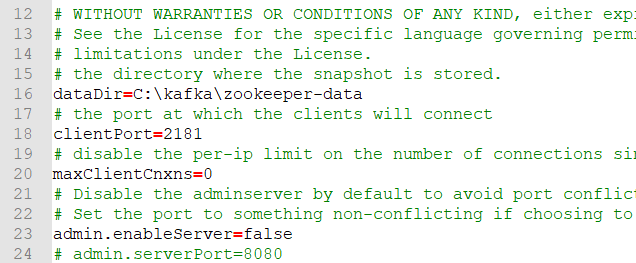

In this post, we will look at the step-by-step process for Kafka Installation on Windows. Kafka is an open-source stream-processing software platform and comes under the Apache software foundation.


## **What is Kafka?**

Kafka is used for real-time streams of data, to collect big data, or to do real-time analysis (or both). Kafka is used with in-memory microservices to provide durability and it can be used to feed events to complex event streaming systems and IoT/IFTTT-style automation systems. 


## **Installation :**


### 1. Java Setup: 

Kafka requires Java 8 for running. And hence, this is the first step that we should do to install Kafka. To install Java, there are a couple of options. We can go for the Oracle JDK version 8 from the [Official Oracle Website](https://www.oracle.com/java/technologies/javase/javase-jdk8-downloads.html).


### 2. Kafka & Zookeeper Configuration:

**Step 1:** Download Apache Kafka from its [Official Site](https://kafka.apache.org/downloads).

**Step 2:** Extract tgz via cmd or from the available tool  to a location of your choice:


```
tar -xvzf kafka_2.12-2.4.1.tgz
```


**Step 3:** Copy the path of the Kafka folder. Now go to _config_ inside Kafka folder and open _zookeeper.properties_ file. Copy the path against the field _dataDir_ and add _/zookeeper-data_ to the path.


**Step 4:** we have to modify the config/server.properties file. Below is the change:


```
fileslog.dirs=C:\kafka\kafka-logs
```


Basically, we are pointing the log.dirs to the new folder /data/kafka.


## **Run Kafka Server:**

**Step 1:** Kafka requires Zookeeper to run. Basically, Kafka uses Zookeeper to manage the entire cluster and various brokers. Therefore, a running instance of Zookeeper is a prerequisite to Kafka.

To start Zookeeper, we can open a PowerShell prompt and execute the below command:


```
.\bin\windows\zookeeper-server-start.bat .\config\zookeeper.properties
```


If the command is successful, Zookeeper will start on port 2181.

**Step 2:** Now open another command prompt and change the directory to the kafka folder. Run kafka server using the command: 
```
.\bin\windows\kafka-server-start.bat .\config\server.properties
```

**Now your Kafka Server is up and running**, you can create topics to store messages. Also, we can produce or consume data directly from the command prompt.


## **Create a Kafka Topic:**


1. Open a new command prompt in the location C:\kafka\bin\windows.
2. Run the following command:


```
kafka-topics.bat --create --zookeeper localhost:2181 --replication-factor 1 --partitions 1 --topic test
```


## **Creating Kafka Producer:**


1. Open a new command prompt in the location C:\kafka\bin\windows
2. Run the following command:


```
kafka-console-producer.bat --broker-list localhost:9092 --topic test
```


## **Creating Kafka Consumer:**


1. Open a new command prompt in the location C:\kafka\bin\windows.
2. Run the following command:


```
kafka-console-consumer.bat --bootstrap-server localhost:9092 --topic test --from-beginning
```


If you see these messages on consumer console,*Congratulations!!!* you all done. Then you can play with producer and consumer terminal bypassing some Kafka messages.

                                                                                                       

 